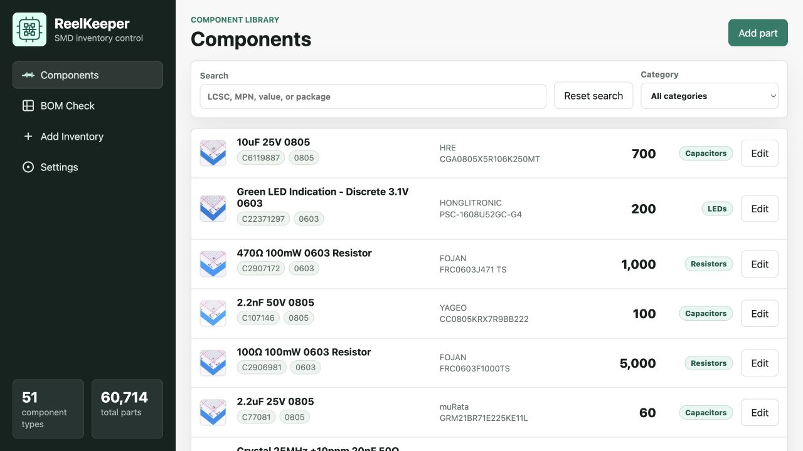
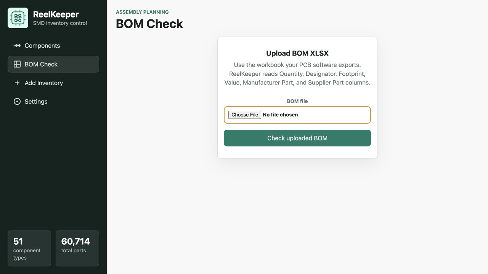
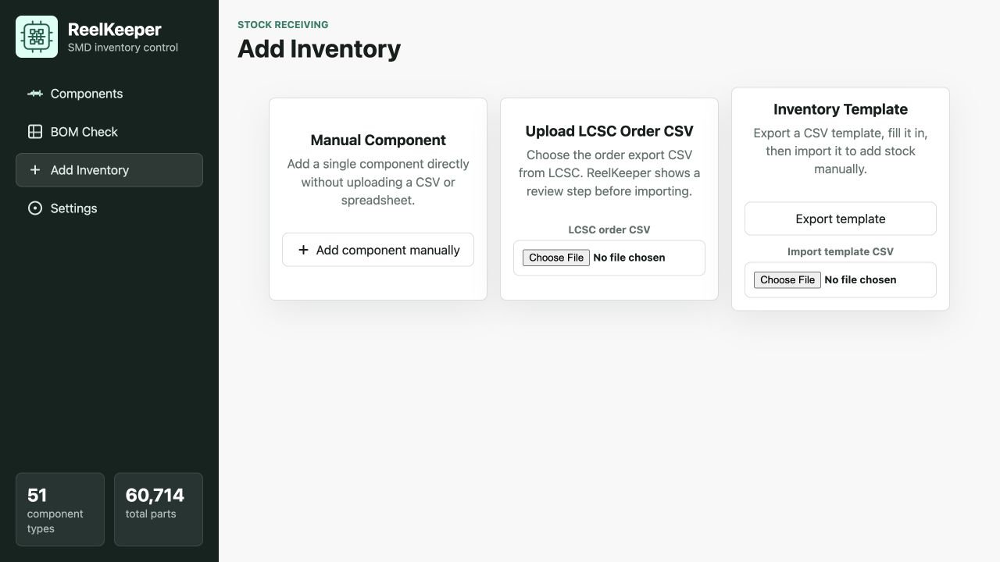

# ReelKeeper

<p align="center">
  
</p>

ReelKeeper is a self hosted inventory management software for PCB components. I have tons of different SMD and through hole components for my PCB projects, and they are difficult to keep track of, so I designed this.

## Features

- Bulk uploads of components from a .csv file, or using the .xlsx from LCSC. I get all my parts from them so using the LCSC feature will pull photos of the parts and some other cool info.
- BOM checking: References your library to a bill of materials for a current project. It will do its best to match components that fit the bill, not specific to brands. For example it will choose any capacitor that is over 12v, is 0805, etc..
- Full API: I added this so I could have my pick and place automatically adjust my database every time it places a component. If you are interested in the scripts for that send me a message! It is all documented in the settings>API page.

## Screenshots

### Component library



### BOM checking



### Adding inventory



## Run locally

```bash
npm install
npm run dev
```

Open `http://localhost:3000`.

## Run with Docker

```bash
git clone https://github.com/Nick-116/ReelKeeper.git
cd ReelKeeper
docker compose up --build
```

Inventory data is stored at `data/reelkeeper.json` through the mounted volume.

The Unraid icon URL is:

```text
https://raw.githubusercontent.com/Nick-116/ReelKeeper/main/public/ReelKeeper-logo.png
```

## API highlights

- `GET /api/parts`
- `POST /api/parts`
- `PATCH /api/parts/:id`
- `DELETE /api/parts/:id`
- `POST /api/import/order`
- `POST /api/bom/check`
- `POST /api/bom/upload`
- `POST /api/use` with an LCSC part number, MPN, or component id and the quantity used
- `GET /api/docs`

The in-app Settings page includes copyable examples for order imports, BOM checks, and marking components as used.

## BOM compatibility rules

ReelKeeper marks exact LCSC or manufacturer part matches as compatible. For resistors, capacitors, and inductors, it can also substitute by inferred category, matching package, matching electrical value, and equal-or-higher voltage when voltage is known. For semiconductors, ICs, connectors, fuses, LEDs, switches, and modules, ReelKeeper requires an exact LCSC or manufacturer part match.
